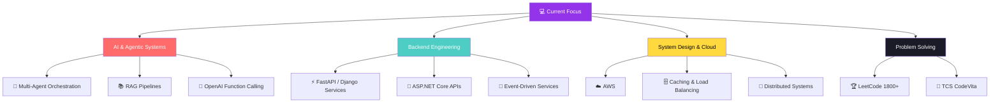
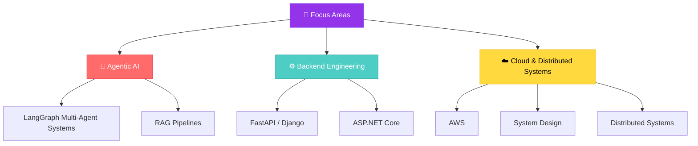

<div align="center">


# 👨‍💻 Pradeep Rawat

**Software Engineer & Backend Developer** | Python · FastAPI · .NET · Agentic AI · System Design

<a href="https://github.com/ThakurPradeepRawat">
  
</a>

[](https://linkedin.com/in/thakur-pradeep-rawat)
[](mailto:p.s.rawat4458@gmail.com)
[](https://leetcode.com/u/Pradeep1195/)
[](https://github.com/ThakurPradeepRawat)

<br>


</div>

---

<div align="center">

### 🧭 Quick Navigation

[📊 Stats](#-github-stats) · [👋 About](#-about-me) · [🛠️ Tech Stack](#️-tech-stack) · [💼 Experience](#-experience) · [🚀 Projects](#-featured-projects) · [🏆 Achievements](#-achievements) · [🎓 Education](#-education) · [🗺️ Roadmap](#️-roadmap)

</div>

---

<div align="center">

</div>

## 📊 GitHub Stats

<div align="center">


<br>


<br>


<br>


</div>

---

## ⭐ Repository Stars

<div align="center">


</div>

---

<div align="center">

</div>

## 👋 About Me

```typescript
const pradeep: Developer = {
  name:     "Pradeep Rawat",
  role:     "Software Engineer | Backend Developer",
  location: "🇮🇳 India  ·  Open to Backend / SDE-1 roles",

  focus: [
    "⚙️ Scalable REST APIs and event-driven services",
    "🤖 Agentic AI — multi-agent orchestration, RAG, function calling",
    "🧠 System design tradeoffs: caching, load balancing, queues, consistency",
    "☁️ Cloud (AWS) & distributed systems",
    "🏆 Competitive programming — 450+ problems solved",
  ],

  stack: {
    languages: ["Python", "C", "SQL", "TypeScript", "Bash"],
    backend:   ["FastAPI", "Django", "ASP.NET Core", "GraphQL", "WebSockets"],
    frontend:  ["Angular"],
    database:  ["PostgreSQL", "MySQL", "SQL Server", "Redis", "MongoDB"],
    cloud_sys: ["AWS", "Docker", "Kafka", "Nginx", "GitHub Actions", "Prometheus", "Grafana"],
    ai_ml:     ["LangChain", "LangGraph", "OpenAI API"],
    testing:   ["Pytest", "Locust", "Postman", "Swagger"],
  },

  learning:  ["System Design", "Cloud (AWS)", "Distributed Systems"],
  principle: "Scalable · Tested · Measured · Always improving",
};
```

<div align="center">

📫 **Reach me at** [p.s.rawat4458@gmail.com](mailto:p.s.rawat4458@gmail.com)

</div>

---

<div align="center">

</div>

## 🛠️ Tech Stack

<div align="center">

<a href="https://skillicons.dev">
  
</a>

<br><br>

**Languages**


**Frameworks & Backend**


**Databases**


**System Design, Cloud & DevOps**


**Agentic AI / LLMs**


**Testing & Tools**


</div>

---

<div align="center">

</div>

## 💼 Experience

### Software Development Intern — Larsen & Toubro, Chennai
*Jan 2026 – Jul 2026*

  

- 🤖 Built an **ML.NET chatbot** enabling natural-language leave requests, cutting processing time by **~90%**
- 🔄 Replaced manual, email-based approvals with an in-system workflow, reducing approval time by **80%+**
- ⚡ Consolidated multiple REST APIs and stored procedures into a unified API, reducing average latency from **~200ms to ~80ms**

---

<div align="center">

</div>

## 🚀 Featured Projects

<!-- ─────────────────────────────────────────────────────────────────
     HOW TO ADD A PROJECT:
     Copy a project block below and fill in:
       - Name (bold, with emoji)
       - One-line description
       - Tech badges  →  
       - Key results as bullets
       - Source link  →  [Repo](URL)
───────────────────────────────────────────────────────────────── -->

### ⭐ Flagship: Agentic AI Interview Assistant

**Planner → Evaluator → Critic** — *Multi-agent technical interviews, automated.*

A multi-agent technical interview automation platform. A LangGraph-orchestrated planner → evaluator → critic loop drives each interview, with structured scoring via OpenAI function calling, sandboxed code execution, and Redis-cached multi-turn sessions on top of PostgreSQL.

- 🎯 **Automated 80%+ of interview evaluation** through structured scoring
- 👥 **Supports 100+ concurrent** multi-turn interview sessions
- 📈 **Load-tested with Locust:** 50+ requests/sec at <500ms p99 latency
- 🧠 **Multi-agent orchestration** with a critic stage to validate evaluator output

    

### 🌐 Backend & System Design

| Project | Description | Tech | Key Results | Source |
|---|---|---|---|---|
| 🔗 **Scalable URL Shortener** | Distributed URL-shortening service designed for high throughput and low-latency redirects. Base62 encoding with distributed counters across 3 EC2 instances. |     | 10M+ URLs supported · 95% cache-hit rate · redirects 120ms → 8ms · 3,200 req/sec at <50ms p99 (5,000 concurrent users) | [Repo](#) |
| 🤖 **Agentic AI Interview Assistant** | Multi-agent interview platform (see flagship above). |   | 100+ concurrent sessions · 50+ req/sec at <500ms p99 | [Repo](#) |

<!-- Replace each (#) above with your real repository URL. -->

---

<div align="center">

</div>

### 💡 What I'm Building



---

<div align="center">

## 🌟 Skills & Interests

</div>

<table>
  <tr>
    <td width="33%" valign="top">
      <h3>🎯 Currently Focused On</h3>
      - 🔭 Building <strong>agentic AI systems</strong><br>
      - 🧠 Mastering <strong>System Design</strong><br>
      - ☁️ Deepening <strong>Cloud (AWS)</strong><br>
      - 🔄 Learning <strong>Distributed Systems</strong><br>
      - 🤝 Seeking <strong>Backend / SDE-1 roles</strong>
    </td>
    <td width="33%" valign="top">
      <h3>⚙️ Engineering Strengths</h3>
      - 🚀 <strong>REST API</strong> design & optimization<br>
      - 🗄️ <strong>Caching</strong> with Redis<br>
      - 📨 <strong>Event-driven</strong> architecture<br>
      - 📈 <strong>Load testing</strong> with Locust<br>
      - 📊 <strong>Observability</strong> with Prometheus & Grafana
    </td>
    <td width="33%" valign="top">
      <h3>🎓 Always Learning</h3>
      - 🧩 Solving LeetCode problems<br>
      - 🏁 Competing in coding contests<br>
      - 🏗️ Building side projects<br>
      - 📚 Studying system design<br>
      - 🌱 Growing every day
    </td>
  </tr>
</table>

---

<div align="center">

</div>

## 🏆 Achievements

| Achievement | Details |
|---|---|
| 🥇 **HackerRank** | 5-Star Gold Badges in **Python** and **SQL** |
| 🎖️ **TCS CodeVita Season 13 (2025)** | Global Rank **2772** |
| 📈 **Competitive Programming** | **450+** problems solved · LeetCode rating **1800+** · top **~8%** globally |


---

<div align="center">

</div>

## 🎓 Education

| Degree | Institution | CGPA | Graduated |
|---|---|---|---|
| 🎓 **B.Tech, Computer Science & Engineering** | SAM Global University, Bhopal | **8.51 / 10** | **2026** |

---

<div align="center">

</div>

## 🗺️ Roadmap



---

<div align="center">

</div>

## 🎨 Shipped So Far


---

<div align="center">


<br>

### 🤝 Let's Build Something Together

*Open to Backend / SDE-1 roles — always happy to talk system design, agentic AI, or a good LeetCode problem.*

[](mailto:p.s.rawat4458@gmail.com)
[](https://linkedin.com/in/thakur-pradeep-rawat)
[](https://github.com/ThakurPradeepRawat)

<br>


**⭐️ From [ThakurPradeepRawat](https://github.com/ThakurPradeepRawat) — Made with 💜 in Markdown**


</div>
